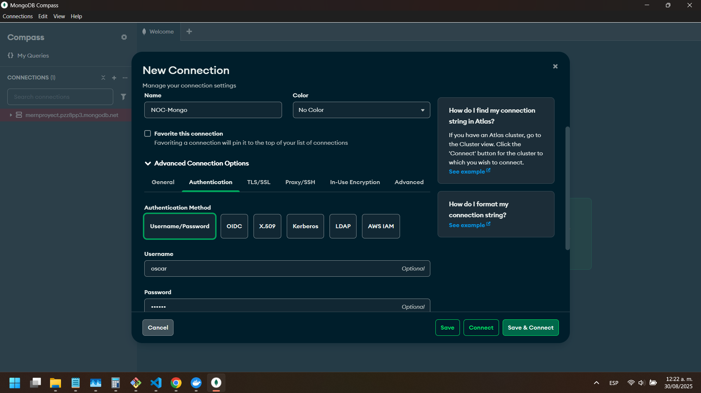
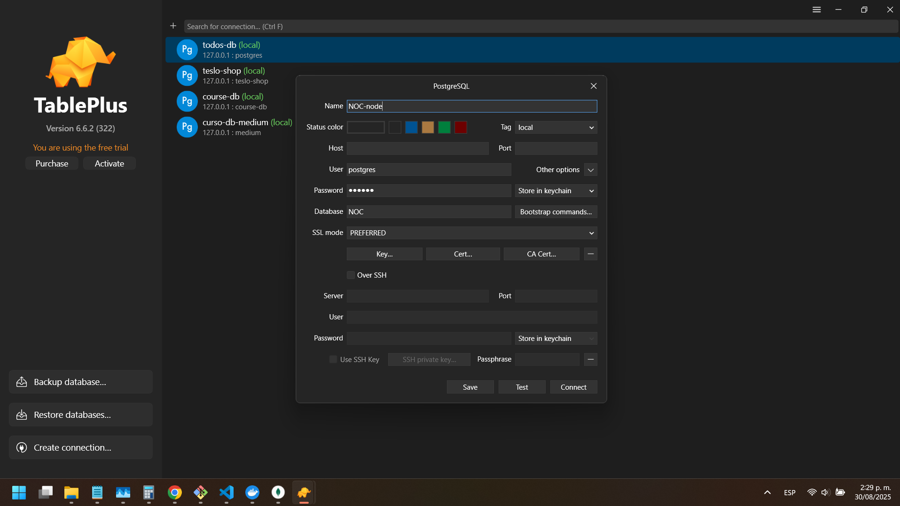
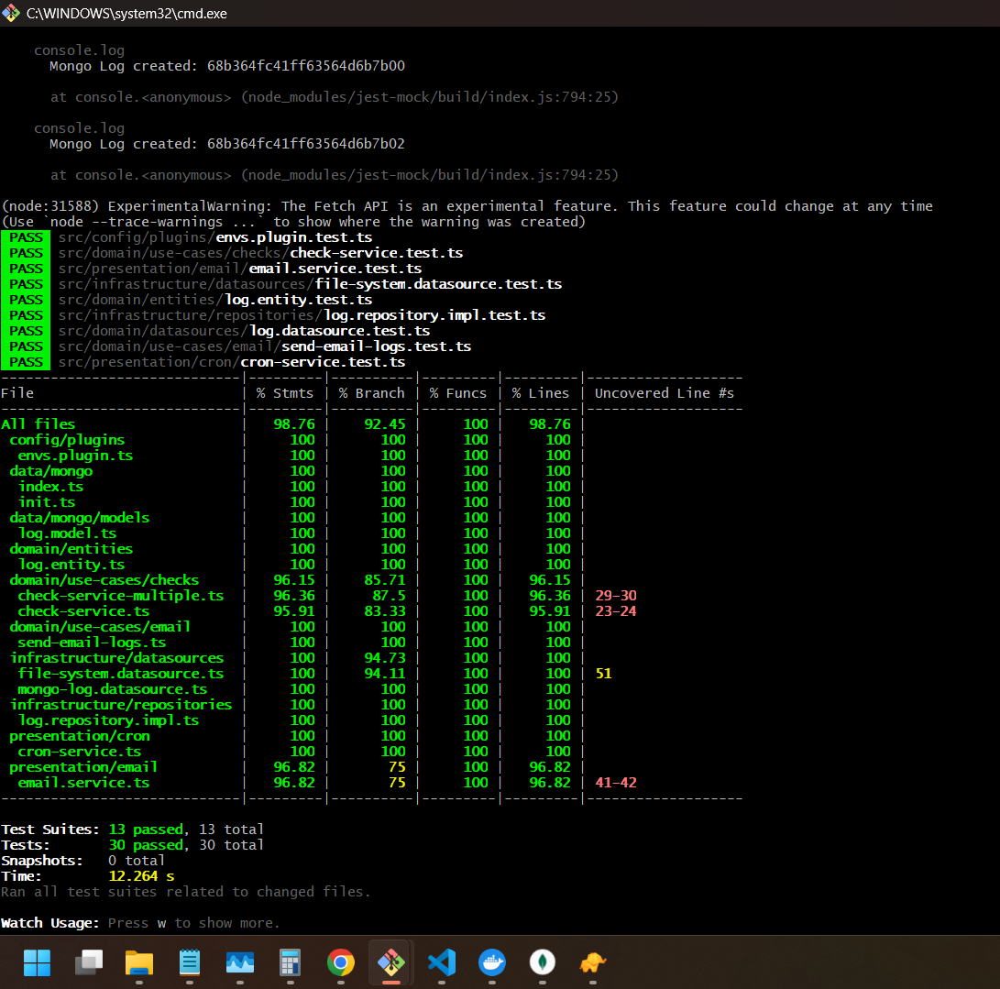
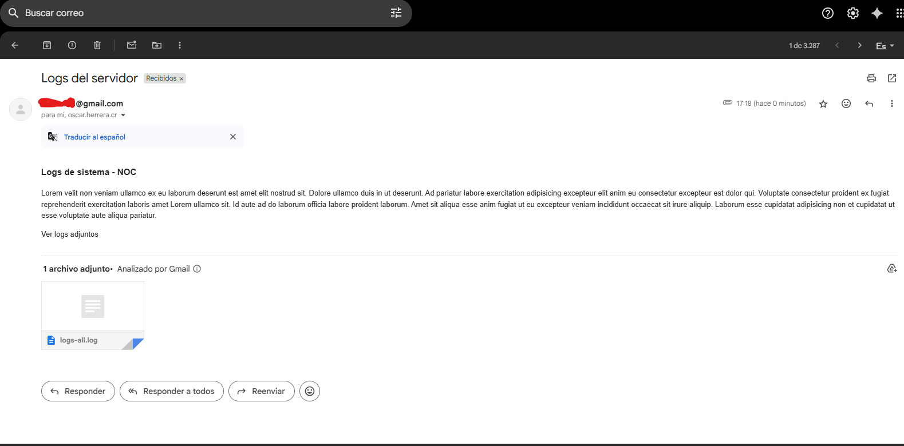
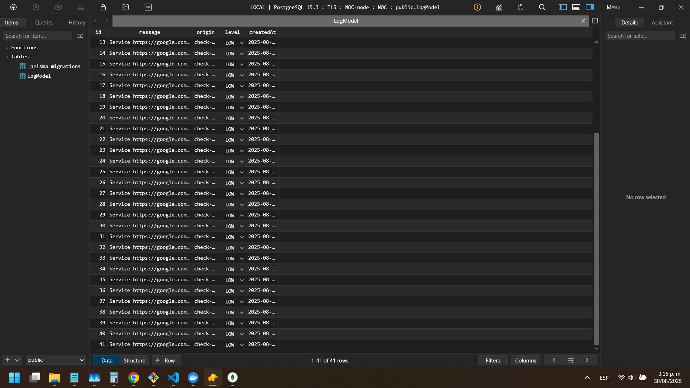
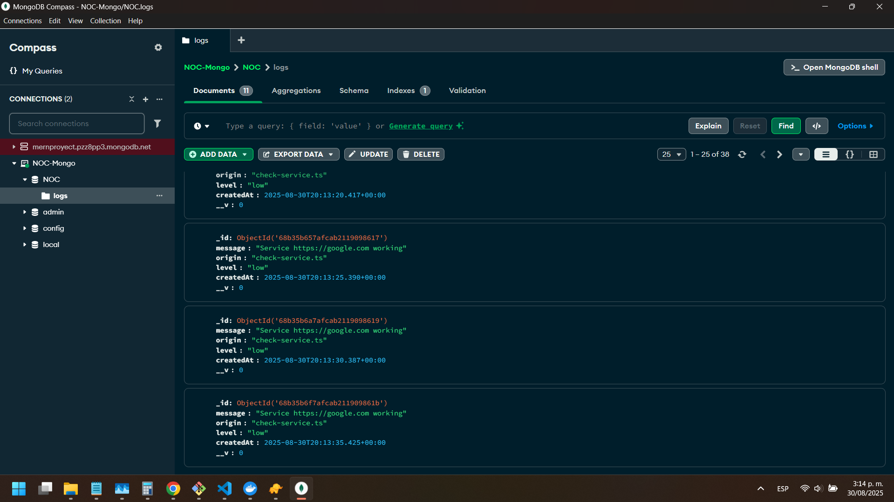
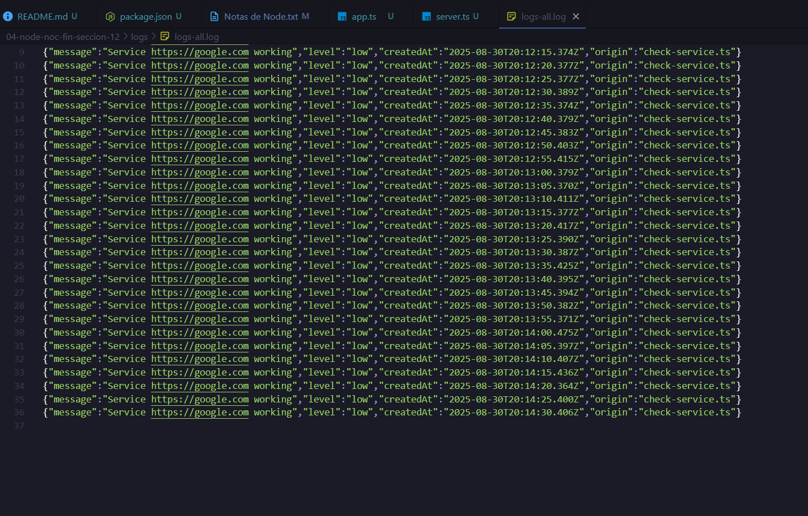

# Proyecto NOC

El objetivo es crear una serie de tareas usando Arquitectura Limpia con TypeScript.
Este proyecto se trata de la implementacion de logs, patron de repositorios y clean arquitecture, manejo de diferentes data source como el file system, postgres y mongodb, ademas se maneja el uso de correos electronicos. Contiene pruebas unitarias.

# dev
1. Clonar el archivo .env.template a .env
2. Configurar las variables de entorno. Obtener Gmail Key: [Google AppPasswords](https://myaccount.google.com/u/0/apppasswords)

3. Ejecutar el comando ```npm install```
4. Levantar las bases de datos con el comando, abrir docker desktop y asegurarse que las dos bases de datos esten corriendo en el contenedor que se creó:
   ```
   docker compose up -d
   ```
Abrir MongoDB Compass y crear nueva conexion y colocar el usuario y contraseña que estan en los environments


5. Ejecutar el comando:
  ```
  npx prisma migrate dev
  ```
Abrir tableplus y configurar la bd de postgres:
  
6. Ejecutar: ```npm run dev```

# Testing:

``` npm run test:watch ```



Nota: Al correr las pruebas, tuve problemas al arrancar la aplicacion, entonces coloqué ```docker compose up -d``` y ya la bd de mongo volvio a funcionar


# Screenshots:









